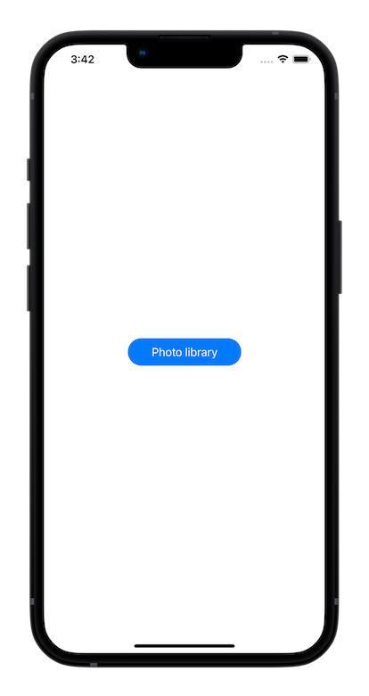

    <h1>Pycker</h1>
    <i>A simple app showing how to use PHPickerViewController in SwiftUI</i>

 

    Information
     
    
    

---

## Key Features
- Vanilla SwiftUI + Combine + MVVM
- No external dependencies
- UIViewControllerRepresentable

## Screenshot

## Getting Started

### Prerequisites
1. Xcode
2. macOS Monterey

### Installation
1. Clone or download the project to your local machine
2. Run the simulator

## Licence
Pycker is released under the MIT license. See [LICENSE](./LICENSE) for details.
